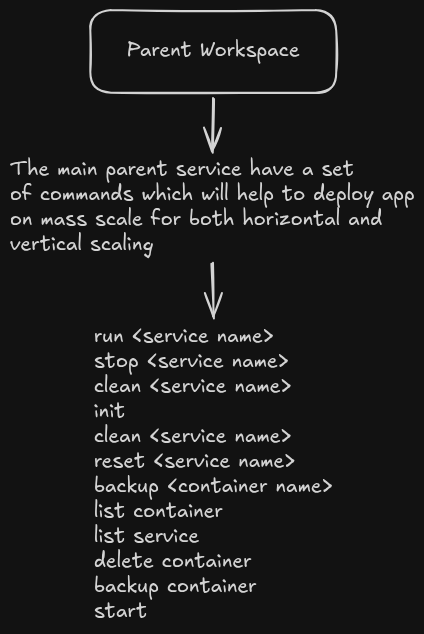
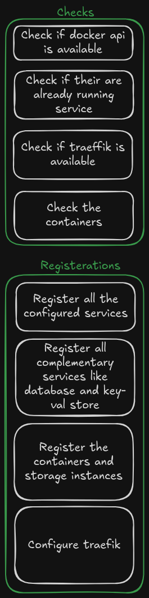
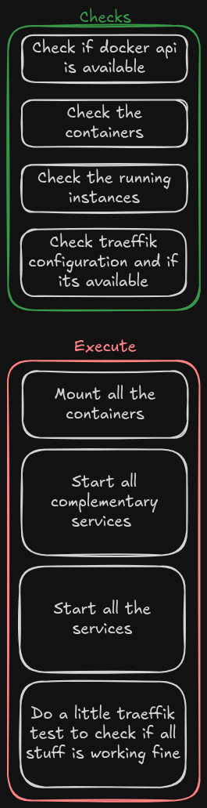

# CLI
I want to make every service easy to deploy and manage. A dockerimage can do the same job but I want to make it easier then before.

## init
Init command is most important command. It is used to initialized a project. 
Stuff which will happen when you run init command.
This command will only register the services and database and whatever service need to function in docker.

## start

Start command start the already initialized services we usually run it after initializing using init command.

This is how it will underhood

other are simpler commands I will make the documentation of them after I implement them in code.
